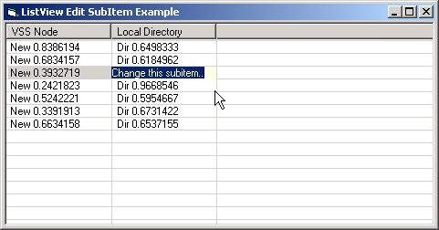



## ListView Editable SubItems

### Description

Create a listview with editable subitems, without using the MSFlexgrid control. Stand alone module can be used for any project where you need this kind of functionality. It doesn't use subclassing, so it will not make your project unstable.
 
### More Info
 
Place 1 ListView control in report mode and 1 textbox on your form. Add the listview32.bas module to your project, and only a view lines of code on your form will do the trick!

Start the example from visual basic, and right click on the listview or (later) on of the created items.

non as I know of, the code is fairly simple, but does the trick.

             |
---                |---
**Submitted On**   |2002-01-07 14:12:10
**By**             |[J\. Klarenbeek](https://github.com/Planet-Source-Code/PSCIndex/blob/master/ByAuthor/j-klarenbeek.md)
**Level**          |Intermediate
**User Rating**    |4.9 (49 globes from 10 users)
**Compatibility**  |VB 6\.0
**Category**       |[Custom Controls/ Forms/  Menus](https://github.com/Planet-Source-Code/PSCIndex/blob/master/ByCategory/custom-controls-forms-menus__1-4.md)
**World**          |[Visual Basic](https://github.com/Planet-Source-Code/PSCIndex/blob/master/ByWorld/visual-basic.md)
**Archive File**   |[ListView\_E46949172002\.zip](https://github.com/Planet-Source-Code/j-klarenbeek-listview-editable-subitems__1-30494/archive/master.zip)

